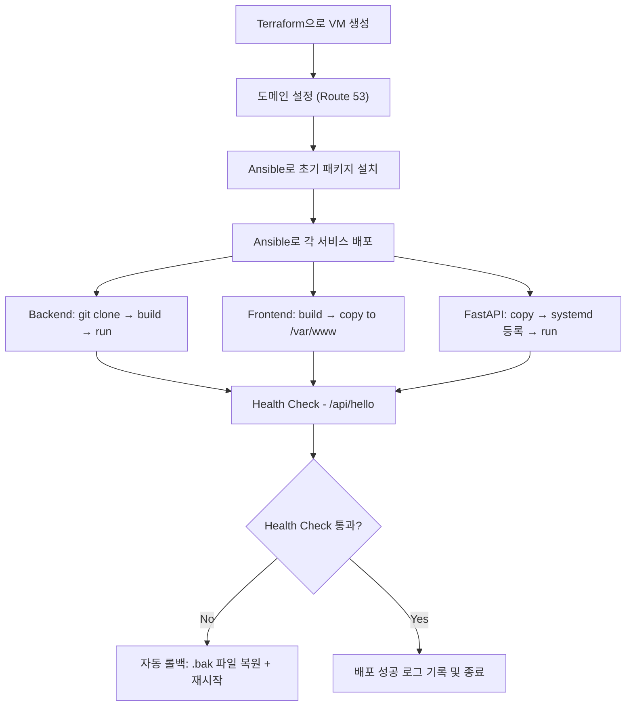

## Terraform 기반 인프라 실행부터 Ansible 배포까지의 전체 흐름

### 1. Terraform 인프라 실행
- 먼저 gcp 키부터 삽입합니다.
```hcl
# provider.tf
provider "google" {
  credentials = file("/Users/lsh/workspace/downloads/keys/ktb-2-moongsan-d9d52232b71b.json") # 키 경로 삽입(json)
  project = var.project_id
  region  = "asia-northeast3"
  zone    = "asia-northeast3-a"
}
```

```bash
cd terraform_gcp_moongsan/
terraform init
terraform apply -auto-approve
```

- Terraform이 완료되면, `outputs.tf`에서 정의한 IP를 출력하여 Ansible에서 사용할 수 있도록 준비합니다.

---

### 2. Route53 A레코드 수동 등록

- Terraform 실행 이후 출력된 Public IP를 기준으로 `Route53`에서 도메인을 수동으로 연결합니다.
  - 예시 도메인: `test.moongsan.com`
  - 연결 대상: `GCP VM 인스턴스의 Public IP`
- mello에게 의뢰하기

---

### 3. Ansible 변수 설정

- Ansible에서 사용할 도메인 관련 설정을 `ansible_moongsan/group_vars/all.yml`에 추가합니다:

```yaml
# 예시
nginx_domain: test.moongsan.com # 연결할 도메인명(라우트53에 등록한)
ssl_email: nangmannsh@gmail.com # 인증서 인증받을 이메일(아무거나 무관)
db_name: mockdb # spring -> application.properties에 기재한 db 명
db_user: mockuser # spring -> application.properties에 기재한 db 유저명
db_password: mockpassword # spring -> application.properties에 기재한 db 유저 패스워드
```

- 또는 서비스별로 분리하여 사용할 경우:(빅뱅에서는 사용하지 않음)

```yaml
frontend_domain: test.moongsan.com
backend_domain: test.moongsan.com
fastapi_domain: test.moongsan.com
```

---

### 4. Ansible 실행

- ansible의 inventory.ini를 수정해야함
```ini
[prod]
<GCP VM 인스턴스의 Public IP> ansible_user=ubuntu ansible_ssh_private_key_file=<내 로컬 상의 ssh 키 경로(공개키 아님)>
```

- ansible 경로로 이동

```bash
cd ansible_moongsan/
```

- 원하는 태그만 실행할 수 있도록 태그 기반으로 플레이북 실행:

```bash
ansible-playbook -i inventory.ini playbook.yml --tags common # 미리 설치할 것들 정의
ansible-playbook -i inventory.ini playbook.yml --tags frontend # 프론트엔드 git pull -> build -> 실행 -> health_check -> .bak 생성
ansible-playbook -i inventory.ini playbook.yml --tags backend # 백엔드
ansible-playbook -i inventory.ini playbook.yml --tags fastapi # ai
ansible-playbook -i inventory.ini playbook.yml --tags nginx_conf # nginx 설정 파일
```

- 전체 실행 시:

```bash
ansible-playbook -i inventory.ini playbook.yml
```

> 실행순서는 playbook의 role이 기재된 순서를 따른다.

```yml
# 현재 작성된 playbook : common -> ... -> frontend
- name: Setup Production Server
  hosts: prod
  become: yes
  roles:
    - {role: common, tags: common}
    - {role: database, tags: database}
    - {role: nginx_conf, tags: nginx_conf}
    - {role: fastapi, tags: fastapi}
    - {role: backend, tags: backend}
    - {role: frontend, tags: frontend}
```

---

### 5. 결과 확인

- 웹 브라우저 또는 curl을 통해 도메인 접근 확인:

```bash
curl -i https://test.moongsan.com
```

- 정상 응답 예시: `HTTP/1.1 200 OK`

---

### 6. Rollback 스크립트 사용법

서비스에 문제가 생겼을 경우, 백업된 파일로 수동 롤백을 진행할 수 있습니다.

#### ./tmp/*.sh vm 환경에 복사

```bash
# 예시 - 로컬에서 VM으로 rollback 스크립트 전송 (SSH 키 방식)
scp -i ~/.ssh/<your-key.pem> ./tmp/rollback_backend.sh ubuntu@<GCP_VM_IP>:~/
scp -i ~/.ssh/<your-key.pem> ./tmp/rollback_frontend.sh ubuntu@<GCP_VM_IP>:~/
scp -i ~/.ssh/<your-key.pem> ./tmp/rollback_ai.sh ubuntu@<GCP_VM_IP>:~/
```

> 아래 내용들은 전부 VM으로 ssh 접속한 상태에서 진행
#### backend

```bash
cd ~
sudo ./rollback_backend.sh
```

#### frontend

```bash
cd ~
sudo ./rollback_frontend.sh
```

#### fastapi

```bash
cd ~
sudo ./rollback_ai.sh
```

- 각 스크립트는 `.bak`으로 백업된 파일이 존재할 때만 동작하며, 실행 중 프로세스를 종료한 뒤 백업 파일로 교체하고 다시 서비스를 기동합니다.
- 애플리케이션이 정상 동작하는지 간단한 curl 기반 health check도 포함됩니다.

#### 백업된 `.bak` 파일의 기본 위치

| 서비스       | 경로                                                       | 설명                                 |
|------------|----------------------------------------------------------|------------------------------------|
| 백엔드      | `/home/ubuntu/mock_backend/build/libs/mock_backend-0.0.1-SNAPSHOT.jar.bak` | Spring Boot 앱 jar 백업              |
| 프론트엔드   | `/var/www/react.bak`                                      | React 정적 파일 디렉터리 백업        |
| FastAPI    | `/home/ubuntu/mock_fastapi/app.bak`                       | FastAPI 앱 디렉터리 전체 백업        |

### 7. 배포 플로우 차트
